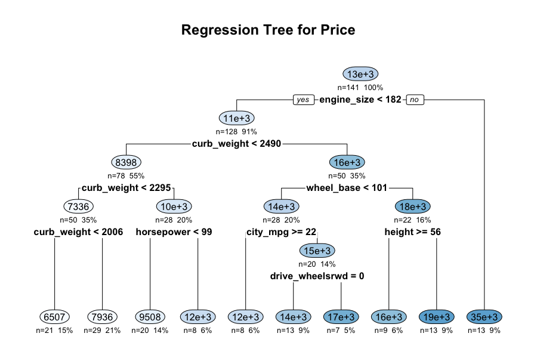
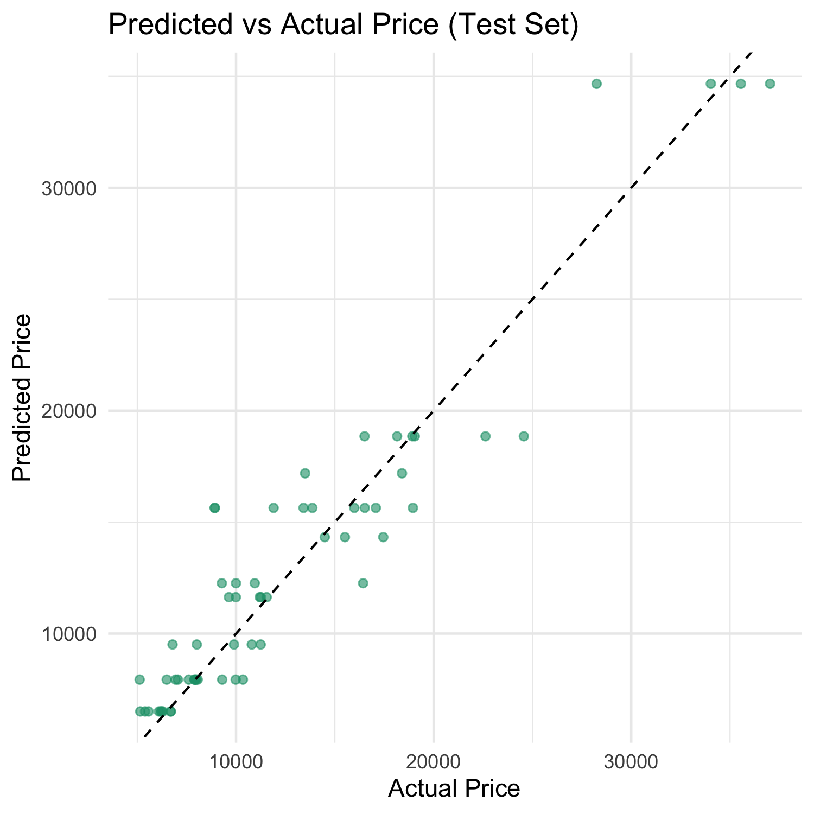

<!-- ────────────────────────────────────────────────────────── -->
<h1 align="center">🚗 AutoVista · Automobile Imports-85 Project</h1>
<p align="center">
  <em>Statistical Methods • Hypothesis Testing • Predictive Modelling</em>
</p>

<p align="center">
  <!-- Badges – change branch or URL if needed -->
  <a href="https://github.com/piotrek1459/AutoVista/actions"></a>
  
  
  
</p>

---

## ✨ Project Snapshot  

<table>
<tr>
  <td align="center">
    <br>
    <sub><b>Interpretable CART model<br>(price prediction)</b></sub>
  </td>
  <td align="center">
    <br>
    <sub><b>Linear-model fit<br>(test set • R² = 0.92)</b></sub>
  </td>
</tr>
</table>

---

## 📦 Contents
| Folder / file                    | What’s inside                                                    |
|----------------------------------|------------------------------------------------------------------|
| `data/`                          | Original UCI Imports-85 dataset (`imports-85.data`, `.names`)    |
| `eda/`                           | Exploratory graphs and summary tables                            |
| `hypothesisTesting/`             | **10 R scripts** (one per hypothesis) + combined report          |
| `predictiveModeling/`            | • `tree.R` (CART) &nbsp;• `regression.R` (OLS + Ridge + Lasso)   |
| `presentation/`                  | Full Beamer slides (`results_presentation.tex`, PDF)             |
| `images/`                        | All PNGs used in slides / README                                 |

---

## 🔬 Statistical Pipeline

| Step | Tool(s) | Highlights |
|------|---------|------------|
| **1. EDA** | `ggplot2`, `dplyr` | Frequency tables, box-plots, histograms |
| **2. Hypothesis tests** | Base R, `coin`, `stats` | Pearson, Spearman (permutation), Welch _t_, ANOVA, χ² (Monte-Carlo), Kruskal–Wallis |
| **3. Predictive models** | `caret`, `rpart`, `glmnet` | CART (interpretable), OLS, Ridge, Lasso |
| **4. Reporting** | **Beamer** slides + knit-ready markdown tables | 90 slides with effect sizes & business take-aways |

---

## 🚀 Quick Start

```bash
# clone & enter project
git clone https://github.com/piotrek1459/AutoVista.git
cd AutoVista


# run all hypothesis tests
Rscript hypothesisTesting/hypTest.R

# train regression tree
Rscript predictiveModeling/tree.R
```


---

## 📈 Key Findings

* **Engine size & horsepower** explain **>75 %** of price variance  
  (Pearson _r_ ≥ 0.81).  
* **Symboling** (risk index) significantly predicts both normalised
  losses (_η²_ = 0.46) and MSRP (Kruskal _W_ = 57.1, _p_ < 1 e-10).  
* **Lasso regression** delivers the lowest RMSE (1 965) –
  a **7 %** error reduction vs OLS –
  while CART offers human-readable pricing rules.  
* No standalone **diesel premium** detected after adjusting for weight
  and manufacturer.

See the 👉 [slides](presentation/results_presentation.pdf) for full
details.

---

## 🤝 Contributing

Pull requests for better visualisations, alternative models (e.g. XGBoost),
or improved documentation are welcome! Please open an issue first to
discuss major changes.

1. Fork the repo  
2. Create your feature branch  
   `git checkout -b feature/amazing-feature`  
3. Commit your changes  
   `git commit -m "Add amazing feature"`  
4. Push to branch + open PR.

---

## 📄 License

Distributed under the MIT License.  
See [`LICENSE`](LICENSE) for more information.

---

<p align="center"><sub>Made with ❤️ &amp; R • 2025</sub></p>
